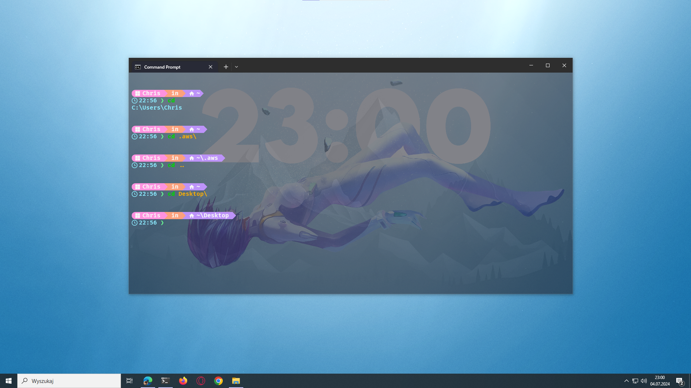

# Windows Terminal

### Starship config directory:
C:\Users\XYZ\.config\starship.toml

### Starship install:

winget install --id Starship.Starship

clink:
https://github.com/chrisant996/clink/releases

Config clink:
1. Otwórz cmd.
2. Utwórz nowy plik konfiguracyjny 'starship.lua' w katalogu '%LocalAppData%\clink\':
```cmd
notepad %LocalAppData%\clink\starship.lua
```
3. Skopiuj i wklej poniższą zawartość do otwartego pliku starship.lua:
```lua
load(io.popen('starship init cmd'):read("*a"))()
```
4. Zapisz i zamknij plik starship.lua.

### docs:
https://starship.rs/installing/

### how it looks:

