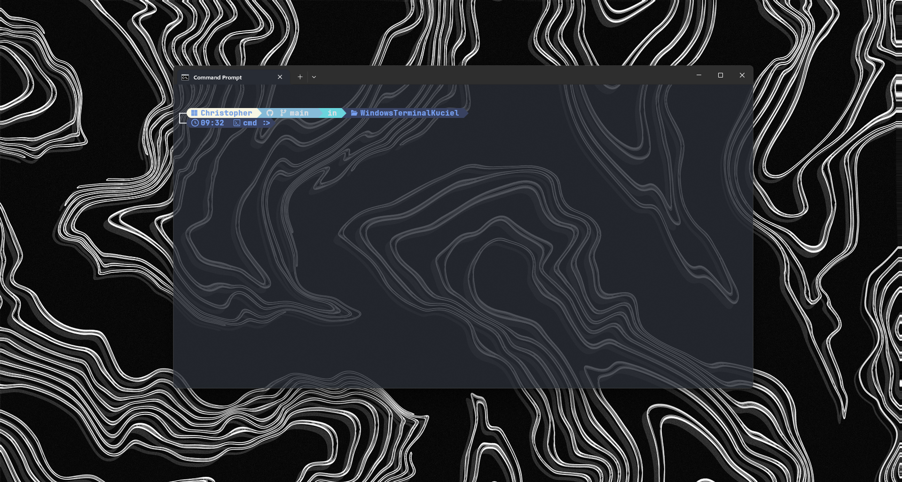
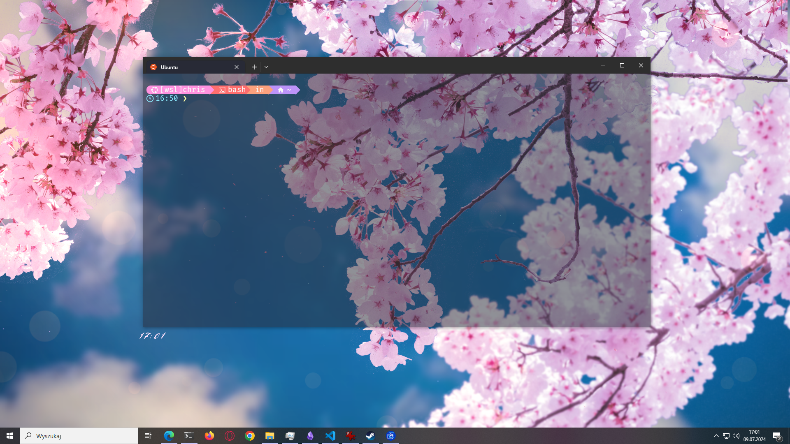

# Windows Terminal and WSL2 Ubuntu and Kali Starship configuration

## Windows

### 1. Starship install:

```cmd
winget install --id Starship.Starship
```

### 2. Download and install clink:

https://github.com/chrisant996/clink/releases

### 3. Config clink:

3.1 Open cmd.

3.2 Create a new configuration file 'starship.lua' in the directory '%LocalAppData%\clink\':

```cmd
notepad %LocalAppData%\clink\starship.lua
```

3.3 Copy and paste this code into 'starship.lua':

```lua
load(io.popen('starship init cmd'):read("*a"))()
```

3.4 Save and quit 'starship.lua'.

### 4. Starship config path:

```cmd
C:\Users\<User_Name>\.config\starship.toml
```

### 5. docs:

https://starship.rs/installing/

### 6. how it looks:



## Linux \[WSL\](Ubuntu)

### 1. Install starship:

```bash
curl -sS https://starship.rs/install.sh | sh
```

### 2. Open .bashrc:

```bash
nano ~/.bashrc
```

### 3. Add at the end:

```bash
eval "$(starship init bash)"
```

### 4. Save and quit

### 5. Starship config path:

```bash
home/<user>/.config/starship.toml
```

### 6. how it looks:



## Linux \[WSL\](Kali)

### 1. Install starship:

```zsh
curl -sS https://starship.rs/install.sh | sh
```

### 2. Open .zshrc:

```zsh
nano ~/.zshrc
```

### 3. Add at the end:

```zsh
eval "$(starship init zsh)"
```

### 4. Save and quit

### 5. Starship config path:

```bash
home/kali/.config/starship.toml
```

### 6. how it looks:


